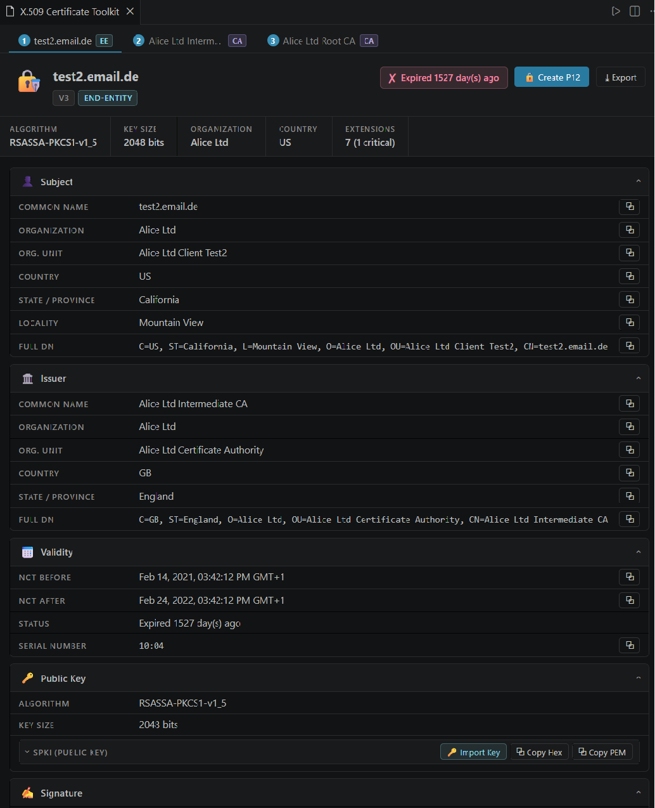

# X.509 Certificate Toolkit

A VS Code extension for viewing, analyzing, and creating X.509 certificates with a rich Svelte-powered webview UI.



## Features

### Viewing Certificates

Open certificates in several ways:

- **From editor selection** — Select any PEM-encoded certificate text in an open file, then right-click → *X.509 Toolkit: Show Certificate from Selection* or use the Command Palette. Works in any file type.
- **Open a certificate file** — Load a PEM, DER, PKCS#7, or PKCS#12/PFX file from disk via the Command Palette.
- **Open a P12/PFX file** — Dedicated command for PKCS#12 keystores. A password prompt appears for encrypted files; leave it empty if the file has no password.

### Certificate Details

Each certificate is presented in collapsible sections:

- **Subject & Issuer** — Common Name, Organization, Org. Unit, Country, State, Locality, Email, Domain Component, User ID.
- **Validity** — Not Before / Not After dates with a live status indicator: *Valid*, *Expiring soon* (≤ 30 days), or *Expired*.
- **Public Key** — Algorithm (RSA, EC, Ed25519, …), key size or named curve, and the full SPKI in hex.
- **Signature** — Algorithm name and raw signature hex.
- **Extensions** — Every X.509 extension is listed with its OID, human-readable name, criticality flag, decoded value, and raw hex. Decoded values include SAN, Key Usage, Extended Key Usage, Basic Constraints, SKI, AKI, CDP, AIA, OCSP, and more. Qualified certificate statements (ETSI EN 319 412-5 / eIDAS) are fully decoded, including QC type (eSign, eSeal, Web), SSCD/QSCD indication, transaction limits, PSD2 payment service provider roles, and applicable legislation.
- **Fingerprints** — SHA-1 and SHA-256, displayed as colon-separated hex.
- **DER hex dump** — Full raw encoding of the certificate.

Every field and hex value has a **copy to clipboard** button.

### Certificate Chains

When a PEM file contains multiple certificates, a tab bar appears at the top so you can navigate between them. Each tab is labelled with the certificate's Common Name and badged as **EE** (end-entity) or **CA**.

### Fetch CA Issuer

When a certificate's Authority Information Access extension contains a CA Issuers URL, a **Load** button appears next to the URL. Clicking it downloads the issuer certificate and adds it as an extra tab in the chain view.

### Private Key Import

You can supply a private key for any certificate in the viewer. The key is loaded from a PEM or DER file (passphrase-protected keys are supported via a prompt) and matched against the certificate's public key.

### Export & Bundle

- **Export as PEM** — Save the certificate (or any cert in a chain) as a `.pem` file.
- **Create P12** — Bundle a certificate, its chain, and an optional private key into a new PKCS#12 file, protected by a password of your choice.

### Create Certificate

The **Create Certificate** command opens a dedicated form to generate a new key pair and certificate:

- **Subject fields** — CN, O, OU, C, ST, L, Email.
- **Subject Alternative Names** — DNS names and IP addresses (one per line).
- **Key algorithm** — RSA-2048, RSA-4096, EC P-256, EC P-384, or EC P-521.
- **Validity period** — Configurable number of days.
- **CA certificate** — Optionally mark the certificate as a CA and set the path-length constraint.
- **Key Usage** — Digital Signature, Key Encipherment, Data Encipherment, Key Cert Sign, CRL Sign; defaults adjust automatically when CA mode or an EC key is selected.
- **Extended Key Usage** — Server Authentication, Client Authentication, Code Signing, Email Protection.
- **Signing mode** — *Self-signed* or *CA-signed*. For CA-signed certificates, select a CA certificate and its private key from disk (passphrase-protected keys are supported).
- **P12 output** — The generated key pair and certificate are saved as a PKCS#12 file with an optional password. The file is then opened immediately in the certificate viewer.

### UI

- Collapsible section cards keep the view uncluttered.
- Long hex values are truncated with a **Show all** toggle.
- Fully integrated with the active VS Code theme — light and dark modes are supported via CSS variables.

## Commands

| Command | Description |
|---|---|
| `X.509 Toolkit: Show Certificate from Selection` | Parse PEM from the active editor's selected text |
| `X.509 Toolkit: Open Certificate File` | Open a PEM, DER, P7B, P12, or PFX file from disk |
| `X.509 Toolkit: Open P12 / PFX File` | Open a PKCS#12 keystore with password prompt |
| `X.509 Toolkit: Create Certificate` | Open the certificate generation form |

The **Show Certificate from Selection** command is also available in the editor **right-click context menu** whenever text is selected.

## Supported Formats

| Format | Extensions | Notes |
|---|---|---|
| PEM | `.pem`, `.crt`, `.cer` | Single certificate or full chain |
| DER (binary) | `.der`, `.cer` | Single certificate |
| PKCS#7 | `.p7b`, `.p7c` | Certificate bundle |
| PKCS#12 / PFX | `.p12`, `.pfx` | Keystore; supports password-protected files |
| Editor selection | — | PEM text selected in any open file |

## Tech Stack

- **Extension host**: TypeScript compiled with webpack
- **Certificate parsing**: [`@peculiar/x509`](https://github.com/PeculiarVentures/x509) + [`@peculiar/webcrypto`](https://github.com/PeculiarVentures/webcrypto)
- **P12 parsing & generation**: [`node-forge`](https://github.com/digitalbazaar/forge)
- **Webview UI**: [Svelte 4](https://svelte.dev/) + [Vite](https://vitejs.dev/)

## Development

```bash
# First-time setup: install all dependencies and do a full build
cd ./x509-toolkit
npm install
npm run build

# Watch mode for iterative development (run in separate terminals):
npm run watch:ext        # webpack watch – rebuilds extension on src/ changes
npm run watch:webview    # vite dev build – rebuilds webview on webview-ui/src/ changes
```

Press **F5** in VS Code (with this folder open) to launch the Extension Development Host.
